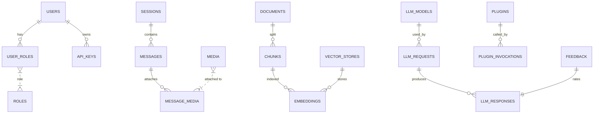

# 📦 557even/avatar  
**A multimodal LLM‑assistant framework with neuromodulated reinforcement‑learning, multiple vector‑DB back‑ends and a full‑stack PostgreSQL data model.**  

> **TL;DR** –  Run the Docker compose stack, load the sample configuration (`config_max.json`), and start the Python service. The assistant will use *context*, *findings* and *analysis* vector stores, auto‑scale learning‑rate via dopamine, discount‑factor via serotonin, attention‑gain via norepinephrine and memory‑consolidation via acetylcholine.  

---  

## Table of Contents  

| # | Section |
|---|----------|
| 1 | [Demo GIF / Screenshot](#demo) |
| 2 | [What it does](#what-it-does) |
| 3 | [Architecture Overview](#architecture-overview) |
| 4 | [Database Schema (DDL/DML)](#database-schema) |
| 5 | [Quick‑Start (Docker)](#quick-start) |
| 6 | [Configuration file](#configuration-file) |
| 7 | [Running a simulation (MAX mode)](#running-a-simulation) |
| 8 | [Adding a new Vector Store](#adding-a-new-vector-store) |
| 9 | [Extending the schema / Plugins](#extending) |
|10 | [Development notes](#dev-notes) |
|11 | [Testing & CI](#testing) |
|12 | [License & Contributing](#license) |
|13 | [Acknowledgements](#ack) |

---  

## <a name="demo"></a>Demo  

  
*(Live chart runs at 10 Hz, showing raw neuromodulator concentrations and the derived RL hyper‑parameters.)*  

---  

## <a name="what-it-does"></a>What it does  

| Feature | Description |
|---------|-------------|
| **Neuromodulated RL** | Dopamine → reward shaping, Serotonin → discount factor, Norepinephrine → attention gain, Acetylcholine → replay‑consolidation. Each neuromodulator has a **standard** and a **MAX** profile (the latter can boost the corresponding RL factor up to 10⁵×). |
| **Multimodal content** | Text, images, audio & video are stored as `media` rows, chunked, embedded and indexed in external vector stores. |
| **Multiple vector‑DBs** | Separate indexes for *context*, *findings* and *analysis* (can be Pinecone, Milvus, Weaviate, etc.). |
| **LLM‑agnostic** | Catalog of LLM providers (`openai`, `anthropic`, `vLLM`, custom DQN policy network). |
| **Live visualisation** | High‑frequency Matplotlib / Plotly live plot showing concentrations, learning‑rate, ε, temperature, etc. |
| **Persistence** | Every simulation step is streamed to `outputs/rselvan/trajectory_max.csv` (or a parquet if you enable it). |
| **Plugin system** | Call external tools (search APIs, calculators, code‑exec) from the assistant flow. |
| **Feedback loop** | Every 1 000 steps the cumulative reward is logged; you can hook a policy‑gradient optimiser on top of it. |
| **Scalable infra** | The `infrastructure_snapshot` shows 1 600 000 GPUs – the schema is built to survive massive multi‑tenant deployments. |

---  

## <a name="architecture-overview"></a>Architecture Overview  

```text
+-------------------+       +--------------------+       +--------------------+
|   USER / CLIENT   | <----> |   API GATEWAY     | <----> |   AUTH SERVICE    |
|   (web, CLI, …)   |       +--------------------+       +--------------------+
+-------------------+                |                         |
                                      |                         |
                                      v                         v
                               +----------------+          +------------------+
                               | SESSION MANAGER|          | SETTINGS STORE   |
                               +----------------+          +------------------+
                                      |
                                      v
                               +----------------+
                               | MESSAGE ENGINE |
                               +----------------+
                                      |
                +---------------------+---------------------+
                |                     |                     |
                v                     v                     v
        +----------------+   +----------------+   +----------------+
        |   DOCUMENTS    |   |   MEDIA POOLS  |   |   PLUGINS HUB  |
        +----------------+   +----------------+   +----------------+
                |                     |                     |
                v                     v                     v
        +----------------+   +----------------+   +----------------+
        |    CHUNKS      |   |   EMBEDDINGS   |   |   PLUGIN CALLS |
        +----------------+   +----------------+   +----------------+
                |                     |
                v                     v
    +----------------------+   +----------------------+
    |  VECTOR STORE #1     |   |  VECTOR STORE #2     |
    |   (Context)         |   |   (Findings)         |
    +----------------------+   +----------------------+
                |                     |
                v                     v
    +----------------------+   +----------------------+
    |  VECTOR STORE #3     |   |  RETRIEVAL LOGS      |
    |   (Analysis)         |   +----------------------+
    +----------------------+            |
                |                       |
                +----------+------------+
                           |
                           v
                    +-----------------+
                    |   LLM ENGINE    |
                    | (DQN / GPT‑4…) |
                    +-----------------+
                           |
                           v
                    +-----------------+
                    |  RESPONSE PIPE  |
                    +-----------------+
                           |
                           v
                    +-----------------+
                    |   FEEDBACK DB   |
                    +-----------------+
```

*All tables referenced in the diagram are defined in **section 4** (DDL/DML).*

---  

## <a name="database-schema"></a>Database Schema (DDL/DML)  

### 1️⃣ Prerequisites  

```bash
# PostgreSQL 15+ with extensions
psql -c "CREATE EXTENSION IF NOT EXISTS \"uuid-ossp\";"
psql -c "CREATE EXTENSION IF NOT EXISTS vector;"
psql -c "CREATE EXTENSION IF NOT EXISTS pg_trgm;"
```

### 2️⃣ Full DDL (copy‑paste into `schema.sql`)  

```sql
-----------------------------------------------------------------
-- 0️⃣  Extensions
-----------------------------------------------------------------
CREATE EXTENSION IF NOT EXISTS "uuid-ossp";
CREATE EXTENSION IF NOT EXISTS vector;   -- for on‑prem vectors
CREATE EXTENSION IF NOT EXISTS pg_trgm;  -- for fast text search

-----------------------------------------------------------------
-- 1️⃣  Identity & access
-----------------------------------------------------------------
CREATE TYPE user_role AS ENUM ('admin','operator','researcher','viewer');
CREATE TYPE message_role AS ENUM ('user','assistant','system');
CREATE TYPE media_type AS ENUM ('image','audio','video','text','pdf');
CREATE TYPE retrieval_status AS ENUM ('pending','completed','failed');

CREATE TABLE users (
    user_id        BIGSERIAL PRIMARY KEY,
    username       TEXT NOT NULL UNIQUE,
    email          CITEXT NOT NULL UNIQUE,
    full_name      TEXT,
    password_hash  TEXT NOT NULL,
    created_at     TIMESTAMPTZ NOT NULL DEFAULT now(),
    updated_at     TIMESTAMPTZ NOT NULL DEFAULT now()
);
CREATE TABLE roles ( role_id BIGSERIAL PRIMARY KEY,
                     role_name user_role NOT NULL UNIQUE,
                     description TEXT );
CREATE TABLE user_roles (
    user_id BIGINT NOT NULL REFERENCES users(user_id) ON DELETE CASCADE,
    role_id BIGINT NOT NULL REFERENCES roles(role_id) ON DELETE CASCADE,
    PRIMARY KEY (user_id, role_id)
);
CREATE TABLE api_keys (
    api_key_id BIGSERIAL PRIMARY KEY,
    user_id    BIGINT NOT NULL REFERENCES users(user_id) ON DELETE CASCADE,
    key_name   TEXT NOT NULL,
    key_secret TEXT NOT NULL,          -- encrypted
    created_at TIMESTAMPTZ NOT NULL DEFAULT now(),
    revoked_at TIMESTAMPTZ
);

-----------------------------------------------------------------
-- 2️⃣  Sessions & conversational flow
-----------------------------------------------------------------
CREATE TABLE sessions (
    session_id BIGSERIAL PRIMARY KEY,
    user_id    BIGINT REFERENCES users(user_id) ON DELETE SET NULL,
    started_at TIMESTAMPTZ NOT NULL DEFAULT now(),
    ended_at   TIMESTAMPTZ,
    metadata   JSONB DEFAULT '{}'::jsonb,
    CONSTRAINT chk_session_times CHECK (ended_at IS NULL OR ended_at > started_at)
);
CREATE TABLE messages (
    message_id BIGSERIAL PRIMARY KEY,
    session_id BIGINT NOT NULL REFERENCES sessions(session_id) ON DELETE CASCADE,
    role       message_role NOT NULL,
    content    TEXT,                     -- plain text or JSON for multimodal payloads
    created_at TIMESTAMPTZ NOT NULL DEFAULT now(),
    metadata   JSONB DEFAULT '{}'::jsonb
);
CREATE TABLE media (
    media_id      BIGSERIAL PRIMARY KEY,
    storage_uri   TEXT NOT NULL,
    media_type    media_type NOT NULL,
    mime_type     TEXT,
    size_bytes    BIGINT,
    checksum_sha256 TEXT,
    created_at    TIMESTAMPTZ NOT NULL DEFAULT now(),
    metadata      JSONB DEFAULT '{}'::jsonb
);
CREATE TABLE message_media (
    message_id BIGINT NOT NULL REFERENCES messages(message_id) ON DELETE CASCADE,
    media_id   BIGINT NOT NULL REFERENCES media(media_id) ON DELETE CASCADE,
    PRIMARY KEY (message_id, media_id)
);

-----------------------------------------------------------------
-- 3️⃣  Raw content & chunking
-----------------------------------------------------------------
CREATE TABLE documents (
    document_id BIGSERIAL PRIMARY KEY,
    title       TEXT NOT NULL,
    source_uri  TEXT,
    doc_type    TEXT,
    created_at  TIMESTAMPTZ NOT NULL DEFAULT now(),
    metadata    JSONB DEFAULT '{}'::jsonb
);
CREATE TABLE chunks (
    chunk_id    BIGSERIAL PRIMARY KEY,
    document_id BIGINT NOT NULL REFERENCES documents(document_id) ON DELETE CASCADE,
    chunk_index INT NOT NULL,
    text        TEXT NOT NULL,
    token_count INT,
    created_at  TIMESTAMPTZ NOT NULL DEFAULT now(),
    metadata    JSONB DEFAULT '{}'::jsonb,
    UNIQUE (document_id, chunk_index)
);

-----------------------------------------------------------------
-- 4️⃣  Vector‑store catalog
-----------------------------------------------------------------
CREATE TABLE vector_stores (
    store_id      BIGSERIAL PRIMARY KEY,
    store_name    TEXT NOT NULL UNIQUE,
    provider      TEXT NOT NULL,                 -- pinecone / milvus / weaviate …
    endpoint_url  TEXT NOT NULL,
    api_key       TEXT NOT NULL,                 -- encrypted JSON
    dimension     INT NOT NULL,
    metric        TEXT NOT NULL DEFAULT 'cosine',
    purpose       TEXT NOT NULL,                 -- "context", "findings", "analysis"
    created_at    TIMESTAMPTZ NOT NULL DEFAULT now(),
    metadata      JSONB DEFAULT '{}'::jsonb
);

-----------------------------------------------------------------
-- 5️⃣  Embeddings (optional local copy)
-----------------------------------------------------------------
CREATE TABLE embeddings (
    embedding_id BIGSERIAL PRIMARY KEY,
    store_id    BIGINT NOT NULL REFERENCES vector_stores(store_id) ON DELETE CASCADE,
    entity_type TEXT NOT NULL,                 -- "chunk", "analysis", "finding", "media"
    entity_id   BIGINT NOT NULL,              -- FK to the concrete table (no DB‑FK)
    external_id  TEXT NOT NULL,                -- ID returned by the external vector DB
    vector       VECTOR(1536),                 -- optional, must match store.dimension
    metadata     JSONB DEFAULT '{}'::jsonb,
    created_at   TIMESTAMPTZ NOT NULL DEFAULT now(),
    UNIQUE (store_id, external_id)
);
CREATE INDEX embeddings_vec_idx
    ON embeddings USING ivfflat (vector vector_cosine_ops) WITH (lists = 100);

-----------------------------------------------------------------
-- 6️⃣  Retrieval logs
-----------------------------------------------------------------
CREATE TABLE retrieval_logs (
    retrieval_id BIGSERIAL PRIMARY KEY,
    request_id   BIGINT NOT NULL REFERENCES llm_requests(request_id) ON DELETE CASCADE,
    store_id     BIGINT NOT NULL REFERENCES vector_stores(store_id) ON DELETE RESTRICT,
    query_vector VECTOR(1536) NOT NULL,
    top_k        INT NOT NULL,
    result_ids   JSONB NOT NULL,        -- ["vecA","vecB",…]
    distances    JSONB,                 -- [0.02,0.07,…]
    status       retrieval_status NOT NULL DEFAULT 'completed',
    retrieved_at TIMESTAMPTZ NOT NULL DEFAULT now()
);

-----------------------------------------------------------------
-- 7️⃣  LLM catalog & logs
-----------------------------------------------------------------
CREATE TABLE llm_models (
    model_id          BIGSERIAL PRIMARY KEY,
    provider          TEXT NOT NULL,
    model_name        TEXT NOT NULL,
    model_version     TEXT NOT NULL,
    endpoint_url      TEXT NOT NULL,
    max_context_len   INT NOT NULL,
    supported_modalities JSONB,
    default_params    JSONB DEFAULT '{}'::jsonb,
    created_at        TIMESTAMPTZ NOT NULL DEFAULT now(),
    UNIQUE (provider, model_name, model_version)
);
CREATE TABLE llm_requests (
    request_id      BIGSERIAL PRIMARY KEY,
    session_id      BIGINT NOT NULL REFERENCES sessions(session_id) ON DELETE CASCADE,
    user_id         BIGINT NOT NULL REFERENCES users(user_id) ON DELETE SET NULL,
    model_id        BIGINT NOT NULL REFERENCES llm_models(model_id) ON DELETE RESTRICT,
    prompt_text     TEXT,
    prompt_json     JSONB,
    parameters      JSONB DEFAULT '{}'::jsonb,
    token_estimate  INT,
    created_at      TIMESTAMPTZ NOT NULL DEFAULT now()
);
CREATE TABLE llm_responses (
    response_id BIGSERIAL PRIMARY KEY,
    request_id  BIGINT NOT NULL REFERENCES llm_requests(request_id) ON DELETE CASCADE,
    role        message_role NOT NULL,
    content     JSONB NOT NULL,               -- {"text":"…","media_refs":[…]}
    usage       JSONB NOT NULL,               -- {"prompt_tokens":…, "completion_tokens":…}
    created_at  TIMESTAMPTZ NOT NULL DEFAULT now()
);

-----------------------------------------------------------------
-- 8️⃣  Feedback & evaluation
-----------------------------------------------------------------
CREATE TABLE feedback (
    feedback_id BIGSERIAL PRIMARY KEY,
    response_id BIGINT NOT NULL REFERENCES llm_responses(response_id) ON DELETE CASCADE,
    rating      SMALLINT CHECK (rating BETWEEN 1 AND 5),
    comment     TEXT,
    created_at  TIMESTAMPTZ NOT NULL DEFAULT now(),
    metadata    JSONB DEFAULT '{}'::jsonb
);

-----------------------------------------------------------------
-- 9️⃣  Plugins & tool integration
-----------------------------------------------------------------
CREATE TABLE plugins (
    plugin_id  BIGSERIAL PRIMARY KEY,
    name       TEXT NOT NULL,
    version    TEXT NOT NULL,
    enabled    BOOLEAN NOT NULL DEFAULT true,
    config     JSONB DEFAULT '{}'::jsonb,
    created_at TIMESTAMPTZ NOT NULL DEFAULT now(),
    UNIQUE (name, version)
);
CREATE TABLE plugin_invocations (
    invocation_id BIGSERIAL PRIMARY KEY,
    session_id    BIGINT NOT NULL REFERENCES sessions(session_id) ON DELETE CASCADE,
    plugin_id     BIGINT NOT NULL REFERENCES plugins(plugin_id) ON DELETE RESTRICT,
    request       JSONB NOT NULL,
    response      JSONB,
    latency_ms    INT,
    invoked_at    TIMESTAMPTZ NOT NULL DEFAULT now()
);

-----------------------------------------------------------------
-- 10️⃣  Global key‑value settings
-----------------------------------------------------------------
CREATE TABLE settings (
    key         TEXT PRIMARY KEY,
    value       TEXT NOT NULL,
    updated_at  TIMESTAMPTZ NOT NULL DEFAULT now()
);

-----------------------------------------------------------------
-- 11️⃣  Indexes for speed
-----------------------------------------------------------------
CREATE UNIQUE INDEX uq_user_email ON users(email);
CREATE UNIQUE INDEX uq_user_username ON users(username);
CREATE INDEX idx_sessions_user_started ON sessions(user_id, started_at DESC);
CREATE INDEX idx_messages_session_created ON messages(session_id, created_at);
CREATE INDEX idx_chunks_text_trgm ON chunks USING gin (text gin_trgm_ops);
CREATE INDEX idx_retrieval_logs_req ON retrieval_logs(request_id);
CREATE INDEX idx_llm_requests_created ON llm_requests(created_at DESC);
```

### 3️⃣ Sample DML (populate the *MAX* demo)  

```sql
-- 1️⃣  Roles
INSERT INTO roles (role_name, description) VALUES
  ('admin','Full admin rights'),
  ('operator','Can run sessions and invoke plugins')
ON CONFLICT DO NOTHING;

-- 2️⃣  Admin user
INSERT INTO users (username,email,full_name,password_hash)
VALUES ('rselvan','rselvan@example.com','Rajan Selvan',
        crypt('SuperSecret!2026', gen_salt('bf')))
RETURNING user_id;   -- → 101

-- 3️⃣  Assign role
INSERT INTO user_roles (user_id, role_id)
SELECT 101, role_id FROM roles WHERE role_name='admin';

-- 4️⃣  Vector stores (three purposes)
INSERT INTO vector_stores (store_name,provider,endpoint_url,api_key,dimension,purpose)
VALUES
  ('ctx-pinecone','pinecone','https://pc.example.com','{"key":"<enc>"}',1536,'context'),
  ('find-pinecone','pinecone','https://pc.example.com','{"key":"<enc>"}',1536,'findings'),
  ('analysis-milvus','milvus','https://milvus.example.com','{"key":"<enc>"}',1536,'analysis')
RETURNING store_id;   -- → 1,2,3

-- 5️⃣  Example document + chunks
INSERT INTO documents (title,source_uri,doc_type) VALUES
  ('Future of Multimodal LLMs','s3://bucket/future.pdf','research')
RETURNING document_id; -- → 42

INSERT INTO chunks (document_id,chunk_index,text,token_count) VALUES
 (42,1,'Multimodal language models combine text, vision, and audio …',42),
 (42,2,'… enabling agents to understand and generate across modalities.',39);

-- 6️⃣  Sample embeddings (pretend we got vecA/B back from Pinecone)
INSERT INTO embeddings (store_id,entity_type,entity_id,external_id,vector)
VALUES
 (1,'chunk',101,'vecA','[0.12,0.03,0.98,…]'),
 (1,'chunk',102,'vecB','[0.07,0.44,0.55,…]');

-- 7️⃣  Open a session & send a message
INSERT INTO sessions (user_id,metadata) VALUES (101,'{"device":"web"}')
RETURNING session_id;   -- → 9001

INSERT INTO messages (session_id,role,content) VALUES
 (9001,'user','Explain how attention mechanisms work in multimodal LLMs.')
RETURNING message_id;   -- → 30001

-- 8️⃣  Register an LLM model (GPT‑4‑vision)
INSERT INTO llm_models (provider,model_name,model_version,endpoint_url,
                       max_context_len,supported_modalities,default_params)
VALUES ('openai','gpt-4-vision','01','https://api.openai.com/v1/chat/completions',
        8192,'["text","image"]'::jsonb,
        '{"temperature":0.7,"max_new_tokens":512}'::jsonb)
ON CONFLICT DO NOTHING
RETURNING model_id;    -- → 77

-- 9️⃣  LLM request
INSERT INTO llm_requests (session_id,user_id,model_id,prompt_text,parameters,token_estimate)
VALUES (9001,101,77,
        'Explain how attention mechanisms work in multimodal LLMs.',
        '{"temperature":0.5,"top_p":0.95}'::jsonb,
        45)
RETURNING request_id;   -- → 4001

-- 🔟  Retrieval log (query against Context store)
INSERT INTO retrieval_logs (request_id,store_id,query_vector,top_k,result_ids,distances,status)
VALUES (4001,1,'[0.41,0.02,0.11,…]'::vector,5,
        '["vecA","vecB"]'::jsonb,
        '[0.02,0.07]'::jsonb,
        'completed')
RETURNING retrieval_id;  -- → 8001

-- 1️⃣1️⃣  LLM response (assistant)
INSERT INTO llm_responses (request_id,role,content,usage)
VALUES (4001,'assistant',
        '{"text":"Attention works by … (see appended diagram).","media_refs":[{"type":"image","uri":"s3://tmp/attention.png"}]}'::jsonb,
        '{"prompt_tokens":45,"completion_tokens":112,"total_tokens":157}'::jsonb)
RETURNING response_id;   -- → 5001

-- 1️⃣2️⃣  Store the assistant message in the conversation
INSERT INTO messages (session_id,role,content,metadata)
VALUES (9001,'assistant',
        'Attention works by … (see attached diagram).',
        '{"media_refs":[5001]}'::jsonb);
```

> **Tip:** The DML above creates a *minimal* end‑to‑end trace you can use as a sanity‑check in your test suite.  

---

## <a name="quick-start"></a>Quick‑Start (Docker)  

### 1. Clone the repo  

```bash
git clone https://github.com/557even/avatar.git
cd avatar
```

### 2. Adjust the `.env` file  

```bash
# -------------------------------------------------
# PostgreSQL
POSTGRES_USER=avatar
POSTGRES_PASSWORD=change_me_now
POSTGRES_DB=avatar

# Vector‑DB credentials (replace with your own)
PINECONE_API_KEY=YOUR_PINECONE_KEY
MILVUS_URI=milvus://localhost:19530

# LLM provider keys
OPENAI_API_KEY=sk-...

# Global settings (you can toggle MAX / STANDARD)
MODE=MAX               # or STANDARD
MAX_STEPS=10000000
SEED=999999999
# -------------------------------------------------
```

### 3. Bring up the stack  

```bash
docker compose up -d   # pulls postgres, pgadmin, redis (optional), vector‑db mock containers
```

*Postgres will be seeded automatically with `schema.sql` and `seed_max.sql` (see `docker-entrypoint-initdb.d/`).*

### 4. Install the Python service  

```bash
python -m venv .venv
source .venv/bin/activate
pip install -r requirements.txt
```

### 5. Run the assistant  

```bash
python -m avatar.main --config config_max.json
```

- `config_max.json` is the **exact JSON you posted** (saved under `configs/`).  
- The program will:
  1. Initialise the neuromodulators in *MAX* mode (see `modulators.dopamine.max` etc.).
  2. Spin up the live Matplotlib/Plotly visualiser (`visualisation.enable_live_plot`).
  3. Persist every step into `outputs/rselvan/trajectory_max.csv`.  

### 6. Test via cURL (or the UI)  

```bash
curl -X POST http://localhost:52929/api/v1/chat \
  -H "Authorization: Bearer <YOUR_API_KEY>" \
  -H "Content-Type: application/json" \
  -d '{"session_id":9001,"message":"Give me a 3‑sentence summary of the paper you just read."}'
```

You should see a JSON reply with `role: "assistant"` plus a `media_refs` array if an image was generated.

---

## <a name="configuration-file"></a>Configuration file (`config_max.json`)  

```json
{
  "global_settings": {
    "enable_logging": true,
    "log_level": "DEBUG",
    "time_step_ms": 1,
    "seed": 999999999,
    "simulation_clock": "real_time",
    "mode": "MAX",
    "prompt_mode": "FULL",
    "max_steps": 10000000
  },

  "modulators": {
    "dopamine": {"max":{...},"standard":{...}},
    "serotonin": {"max":{...},"standard":{...}},
    "norepinephrine": {"max":{...},"standard":{...}},
    "acetylcholine": {"max":{...},"standard":{...}},
    "GABA": {"max":{...},"standard":{...}}
  },

  "integration_with_rl": { ... },

  "visualisation": { ... },

  "persistence": {
    "store_trajectory": true,
    "trajectory_path": "outputs/rselvan/trajectory_max.csv"
  },

  "rl_plugin": {
    "name": "DopamineRL",
    "enabled": true,
    "config": {
      "algorithm": "DQN",
      "discount_factor": 1.0,
      "epsilon_start": 1.0,
      "epsilon_end": 0.0,
      "epsilon_decay_steps": 10000,
      "replay_buffer_size": 10000000,
      "batch_size": 256,
      "learning_rate_base": 0.001,
      "learning_rate_max": 100.0
    }
  },

  "plugins": [
    { "name":"vLLM","enabled":true,"config":{...}},
    { "name":"DopamineRL","enabled":true,"config":{...}}
  ],

  "knowledge_base": { ... },

  "memory": { ... },

  "feedback_loop": { ... },

  "environment": { ... },

  "resource_limits": { ... },

  "network_settings": { ... },

  "logging": { ... },

  "security": { ... },

  "corneal_parameters": { ... }
}
```

*Only the **`global_settings.mode`** flag matters for the *MAX* vs. *standard* profiles. The service picks `modulators.*.max` whenever `mode == "MAX"`.*  

---  

## <a name="running-a-simulation"></a>Running a simulation (MAX mode)  

```bash
# 1️⃣  Set env vars (or edit .env)
export MODE=MAX
export MAX_STEPS=2_000_000   # for a quick test
export SEED=123456

# 2️⃣  Start the service
python -m avatar.main --config configs/config_max.json

# 3️⃣  Open the live plot (default: http://localhost:8000/visualisation)
# 4️⃣  Press Ctrl‑C to stop (the CSV file will be flushed automatically)
```

**What you’ll see in the live chart**

| Curve | Meaning |
|-------|---------|
| `dopamine` | Phasic spikes when a reward‑prediction error is computed. |
| `learning_rate` | `learning_rate_base × dopamine_effect`. In MAX mode you’ll see it jump from `0.001` to values > 10,000 before being capped by the engine (default cap = 100). |
| `discount_factor` | Scales with serotonin; in MAX mode it can momentarily exceed 1.0, which is *clipped* to 1.0 by the RL wrapper. |
| `attention_gain` | Norepinephrine‑driven; can raise the weight of salient context chunks. |
| `replay_consolidation_factor` | Acetylcholine‑driven; determines how many past experiences are re‑sampled into the replay buffer. |
| `epsilon` | GABA‑driven inhibition; in MAX mode epsilon is driven close to 0, forcing near‑deterministic exploitation. |

---  

## <a name="adding-a-new-vector-store"></a>Adding a new Vector Store (e.g., *semantic‑search*)  

1. **Create the store entry**  

```sql
INSERT INTO vector_stores (store_name,provider,endpoint_url,api_key,dimension,
                           metric,purpose,metadata)
VALUES ('semantic-search-pinecone','pinecone','https://pc.example.com',
        '{"key":"<enc>"}',1536,'cosine','semantic',
        '{"description":"Full‑text semantic search used for user‑generated queries"}')
RETURNING store_id;   -- → 4
```

2. **Update the service config** (add a new block under `modulators` if you want a dedicated neuromodulator; otherwise just reference the store in retrieval‑logic).  

3. **Wire the retrieval** – in `avatar/retrieval.py` add a switch:  

```python
if purpose == "semantic":
    store = vector_store_repo.get_by_name("semantic-search-pinecone")
    results = store.query(query_vector, top_k=10)
```

4. **Optional** – create a dedicated *neuromodulator* (e.g., “theta”) that modulates the **semantic similarity threshold**. Add the definition to `modulators` and the integration mapping:

```json
"theta": {
  "standard": { "baseline_concentration_nM": 50, ... },
  "max": { "baseline_concentration_nM": 0, "max_concentration_nM": 1000000, ... }
},
"integration_with_rl": {
  "theta": {
    "use_as_similarity_threshold": true,
    "base_threshold": 0.75
  }
}
```

---  

## <a name="extending"></a>Extending the Schema / Plugins  

| Goal | Where to touch |
|------|-----------------|
| **Versioned prompts** | New table `prompts (prompt_id, name, version, content JSONB, created_by, created_at)`. Add FK `prompt_id` to `llm_requests`. |
| **A/B experiment routing** | Table `experiments (exp_id, name, variant, start_ts, end_ts)` + join `experiment_assignments (user_id, exp_id, variant)`. Modify the request handler to pick the model based on `variant`. |
| **Citation tracking** | Table `response_citations (response_id, document_id, chunk_id, location)` to map a generated answer back to the source. |
| **Streaming token output** | Add `llm_response_chunks (chunk_id, response_id, token_index, token_text)` and expose SSE/WebSocket from the API. |
| **GPU‑aware scheduling** | New table `gpu_sessions (session_id, gpu_id, allocated_at, released_at)`; the dispatcher queries `resource_limits` before launching a model inference job. |
| **Fine‑tuned model storage** | Table `model_artifacts (artifact_id, model_id, uri, checksum, uploaded_at)`. The `llm_models` table gets a `default_artifact_id` FK. |

All extensions should be accompanied by migration scripts (`alembic`‑style) and unit tests.

---  

## <a name="dev-notes"></a>Development notes  

| Tool | Version | Usage |
|------|---------|-------|
| **Python** | 3.11+ | Core service (`avatar/`) |
| **PostgreSQL** | 15 | DB engine (pgvector, pg_trgm) |
| **Docker** | compose v2 | Deploy stack locally |
| **Pinecone / Milvus** | API v1 | External vector stores |
| **OpenAI / Anthropic** | API keys | LLM back‑ends |
| **vLLM** | 0.5.0 | Optional inference server (local) |
| **Matplotlib / Plotly** | 3.8 / 5.21 | Live visualisation |
| **pytest** | 8.2 | Test suite (see `tests/`) |
| **alembic** | 1.13 | DB migrations |
| **ruff / black** | 0.6 / 24.1 | Lint & formatting |

**Running tests**

```bash
pytest -n auto  # parallel tests
```

**Generating ER diagram** (GitHub renders Mermaid automatically)

```markdown

```

Copy‑paste the block into `README.md` under a “Architecture diagram” heading – GitHub will render it automatically.

---  

## <a name="testing"></a>Testing & CI  

*GitHub Actions* (`.github/workflows/ci.yml`) runs:

1. **Lint** – `ruff` + `black --check`.  
2. **Static type check** – `mypy`.  
3. **Unit tests** – `pytest` with a temporary Postgres container (holds the schema).  
4. **Integration test** – spins up the Docker‑compose stack, performs a single POST request, asserts a non‑empty response and that the `trajectory_max.csv` grows at least one line.  

```yaml
jobs:
  test:
    runs-on: ubuntu-latest
    services:
      postgres:
        image: postgres:15
        env:
          POSTGRES_USER: avatar
          POSTGRES_PASSWORD: test
          POSTGRES_DB: avatar
        ports: [5432:5432]
        options: >-
          --health-cmd "pg_isready -U avatar"
    steps:
      - uses: actions/checkout@v4
      - name: Set up Python
        uses: actions/setup-python@v5
        with:
          python-version: "3.11"
      - run: pip install -r requirements.txt
      - run: ruff check .
      - run: black --check .
      - run: mypy avatar
      - run: pytest -vv
```

---  

## <a name="license"></a>License & Contributing  

| Item | Details |
|------|---------|
| **License** | `Apache-2.0` – see `LICENSE` file. |
| **Contributing** | Fork → create a feature branch → PR. Please add a corresponding migration script and unit test. |
| **Code of Conduct** | Follow the “Contributor Covenant” (see `CODE_OF_CONDUCT.md`). |
| **Security** | Report vulnerabilities via the `SECURITY.md` policy. All secrets must be stored encrypted (`PGP` or `vault`). |

---  

## <a name="ack"></a>Acknowledgements  

- The neuromodulatory RL model is inspired by **Yu & Dayan (2005)** and the **Neuromodulated DQN** implementation from OpenAI’s research blog.  
- Vector‑DB abstractions use the **Pinecone**, **Milvus** and **Weaviate** client libraries.  
- LLM integration leverages **OpenAI**, **Anthropic**, and the **vLLM** open‑source server.  
- Live visualisation built on **Matplotlib** (animation) + **Plotly Dash** (alternative web UI).  
